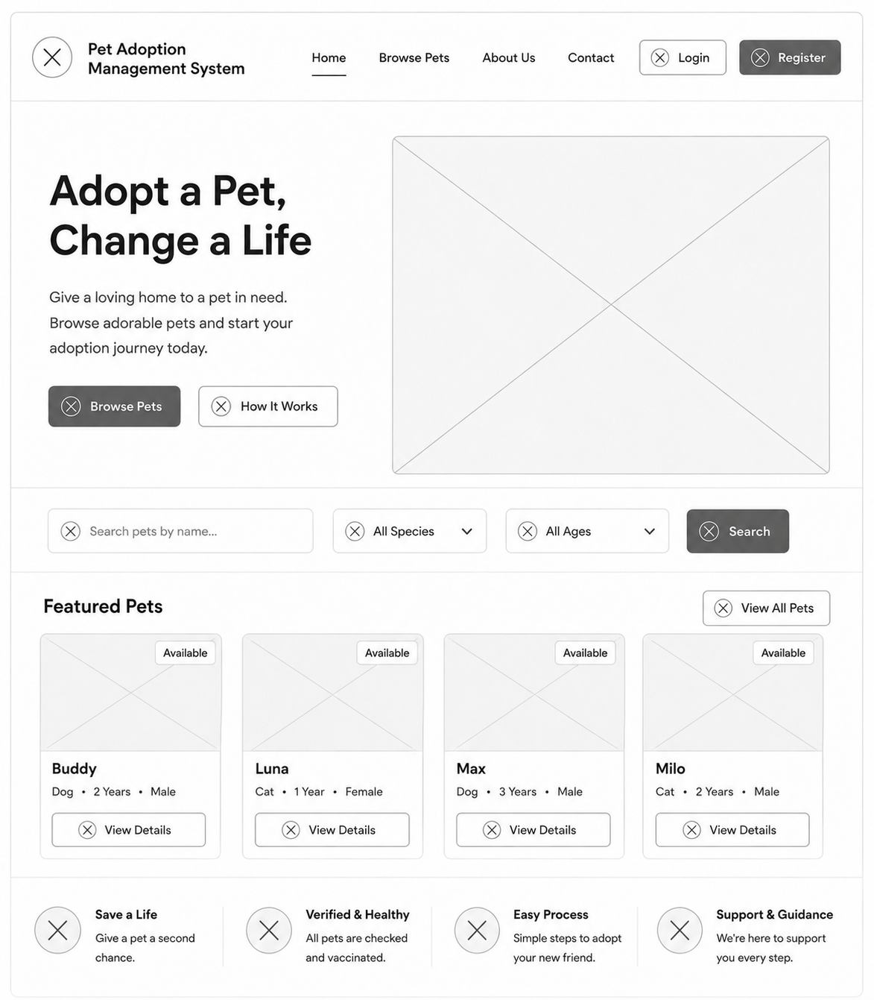
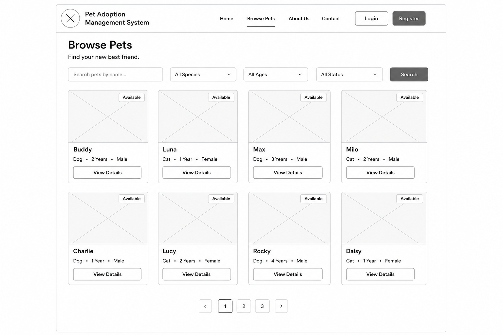
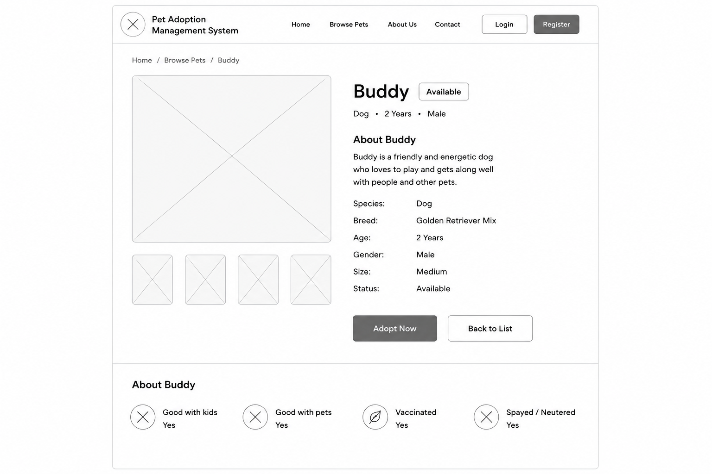
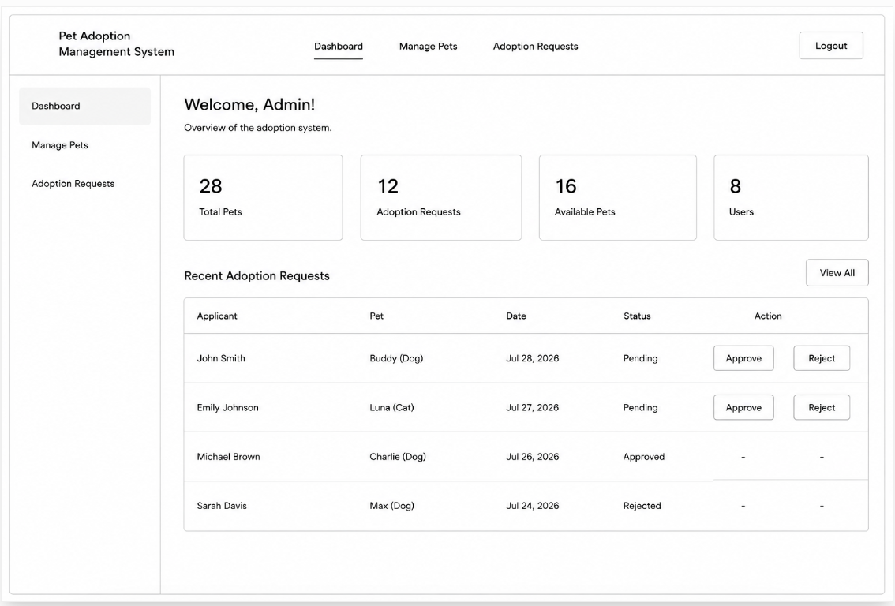
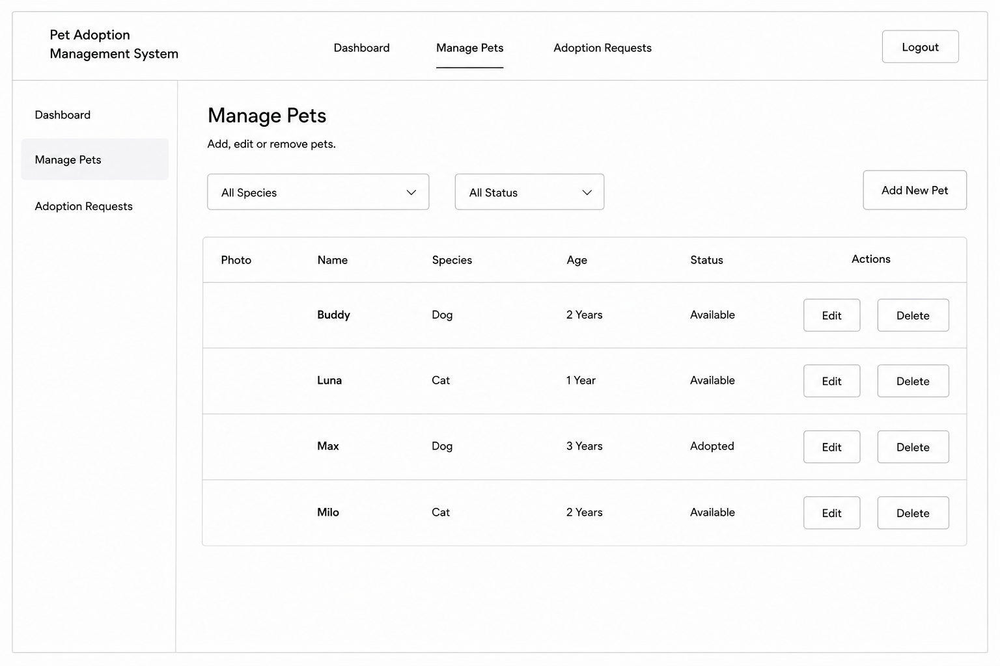
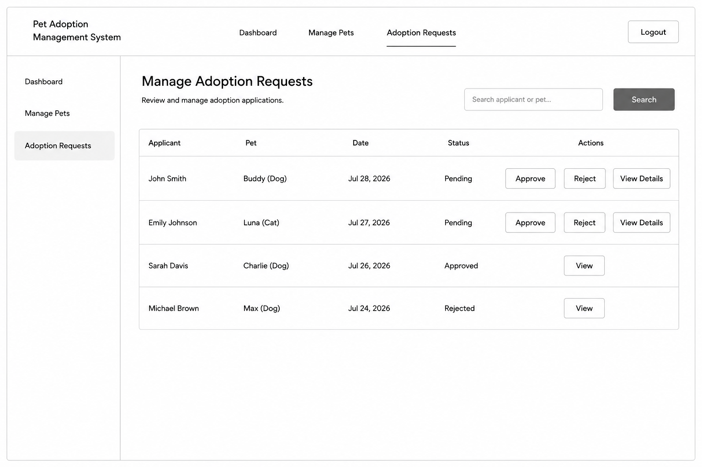

# Project Definition and Scope

## Project Title

**Pet Adoption Management System**

---

# Project Overview

The **Pet Adoption Management System** is a web-based application designed to simplify the pet adoption process for both potential adopters and shelter administrators. The system provides an easy-to-use platform where users can browse available pets, view detailed information about each pet, and submit adoption requests online.

The application also includes an administrative interface that allows authorized staff to manage pet records, review adoption requests, and update the adoption status of pets. The goal is to replace a manual, paper-based process with a secure, organized, and user-friendly web application.

---

# Problem Statement

Many animal shelters still rely on manual processes or basic websites that only display pet information without allowing users to complete the adoption process online. This often results in delayed communication, duplicate enquiries, and inefficient record management.

The Pet Adoption Management System addresses these issues by providing a centralized platform where users can browse available pets, submit adoption requests, and receive updates, while administrators can efficiently manage pets and adoption applications.

---

# Target Users

The system is designed for two main types of users:

### 1. Visitors / Adopters

Visitors can:

* Browse available pets.
* View detailed pet information.
* Register an account.
* Log in securely.
* Submit adoption requests.
* View their adoption request history.

### 2. Administrator

The administrator can:

* Manage pet records.
* Add new pets.
* Edit existing pet information.
* Remove pets from the system.
* Review adoption requests.
* Approve or reject adoption applications.
* Update the adoption status of pets.

---

# Project Scope

The project will focus on developing a functional web application using **Python (Flask)**, **JavaScript**, **Bootstrap 5**, **SQLite**, and **SQLAlchemy**.

The application will provide secure user authentication, pet management, and an adoption request workflow while following the Agile software development process throughout the five-week project.

The project includes both frontend and backend development, database integration, and responsive web design.

---

# Must-Have Features

The following features are essential for the successful completion of the project:

* User registration.
* User login and logout.
* Secure password storage.
* Browse available pets.
* View detailed pet information.
* Submit adoption requests.
* View personal adoption requests.
* Administrator login.
* Add, edit, and delete pet records.
* Review and manage adoption requests.
* Update pet adoption status.
* Responsive user interface.
* Database integration using SQLite.
* Input validation and error handling.

---

# Optional Features

If time permits, the following enhancements may be implemented:

* Search pets by name.
* Filter pets by species or breed.
* Display featured pets on the home page.
* Email notification (future enhancement).
* Pet image gallery.
* User profile editing.
* Improved dashboard statistics.

---

# Technologies

| Component             | Technology               |
| --------------------- | ------------------------ |
| Programming Language  | Python 3                 |
| Backend Framework     | Flask                    |
| Frontend              | HTML5, CSS3, Bootstrap 5 |
| Client-side Scripting | JavaScript               |
| Database              | SQLite                   |
| ORM                   | SQLAlchemy               |
| Version Control       | Git                      |
| Repository Hosting    | GitHub                   |
| UI Design             | Figma                    |
| Project Management    | Trello                   |

---

# Project Deliverables

The project will produce:

* Project definition and scope document.
* Figma UI mockups.
* ER Diagram.
* Website sitemap.
* Flask web application.
* SQLite database.
* GitHub repository.
* Trello Agile board.
* Daily development journal.
* Final project presentation.

---

# Project Objectives

The primary objectives of this project are to:

* Develop a fully functional pet adoption web application.
* Apply Python, Flask, JavaScript, and SQL concepts learned during the course.
* Demonstrate CRUD operations and database relationships.
* Implement secure user authentication.
* Follow Agile development practices using Trello and GitHub.
* Produce a responsive, user-friendly, and maintainable application.

---

# Project Constraints

* The project must be completed within five weeks.
* Development will follow the Agile methodology.
* GitHub will be used for version control.
* Trello will be used for project management.
* The application will use SQLite as the database.
* The frontend will be developed using Flask templates, Bootstrap 5, HTML, CSS, and JavaScript without React.

---

## Wireframes

These wireframes were created during the planning and design phase of the project.

### Home Page

### Browse Pets

### Pet Details

### Admin Dashboard

### Admin Manage Pets

### Admin Adoption of Pet

